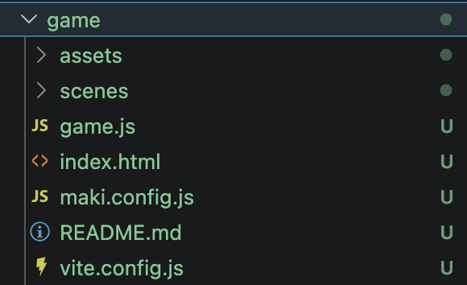
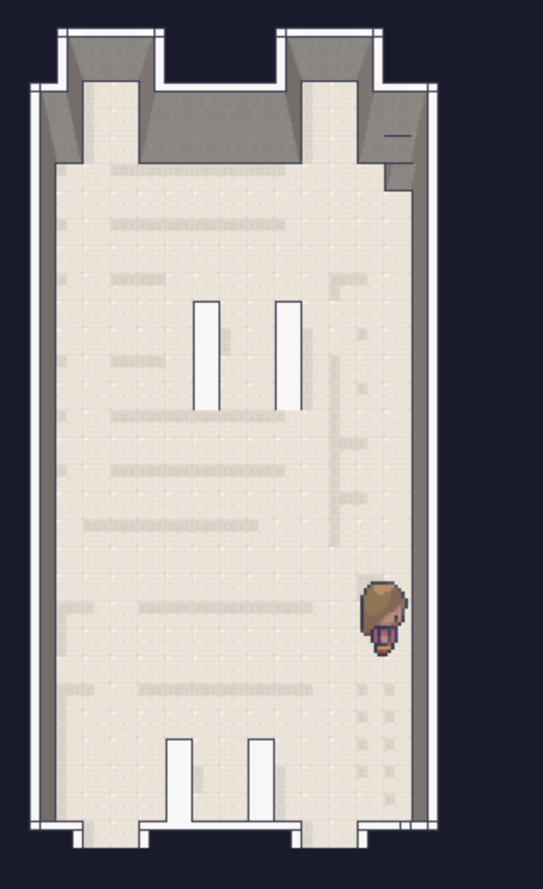
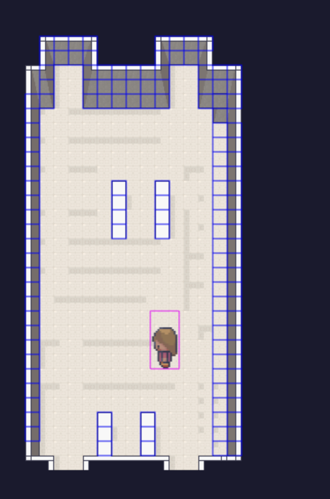
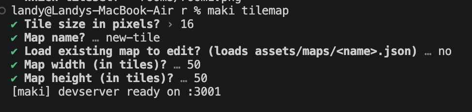
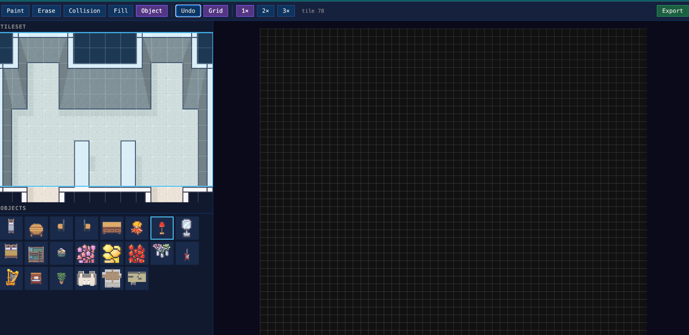
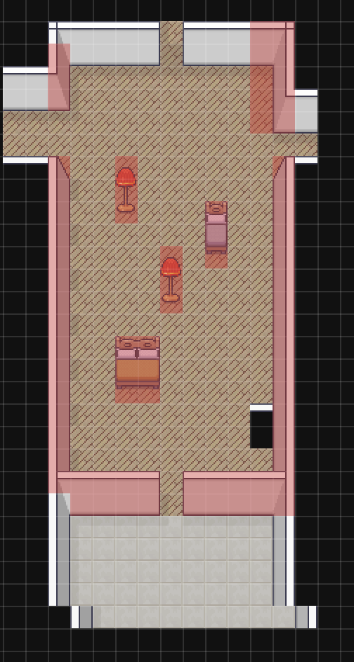

# Maki Game Tutorial

Build your first Maki game, understand the generated project structure, run the game locally, create a custom tilemap, and switch between scenes.

## What you will build

By the end of this tutorial, you will have:

- A new Maki game project.
- A playable character named `lia`.
- A map with collision enabled.
- A custom tilemap created with `maki tilemap`.
- Two scenes that you can switch between with keyboard shortcuts.

---

## 1. Install Maki

Install the Maki package with npm:

```bash
npm install @tialops/maki
```

---

## 2. Create your first game

Create a new game project from the CLI:

```bash
maki new game
```

This creates a `game` folder with a structure like this:



### Project structure

Inside the generated folder, you will find:

- `img/` - template img for the game.
- `scenes/` - scene files for your game.
- `game.js` - the main game entry file.
- `index.html` - the HTML page used by the game.
- `maki.config.js` - Maki configuration.
- `README.md` - the generated README file.
- `vite.config.js` - Vite configuration for local development.

---

## 3. Understand the default game scene

Open the default scene file. It should look similar to this:

```js
import { Scene, manager } from '@tialops/maki'
import NewScene from './NewScene.js'

export default class GameScene extends Scene {
  constructor() {
    super('GameScene')
  }

  preload() {
    this._makiPlayers = []
    super.preload()

    this.lia = this.maki.player('lia')
    manager.map(this, 'default_map')
    manager.preload(this)
  }

  create() {
    super.create()
    manager.create(this)

    // Place Lia in the center of the map.
    // 50 tiles x 16px = 800px, so the center is 400, 400.
    this.lia.sprite.setPosition(400, 400)

    this.physics.add.collider(
      this.lia.sprite,
      manager.getWallGroup(this, 'default_map')
    )

    if (!this.scene.get('NewScene')) {
      this.scene.add('NewScene', NewScene, false)
    }

    this.input.keyboard.on('keydown-T', () => {
      this.scene.stop('GameScene')
      this.scene.start('NewScene')
    })
  }

  update() {
    this.maki.move(this.lia)
  }
}
```

### What this scene does

- `Scene` gives you the Maki scene base class.
- `manager.map(this, 'default_map')` loads the default map.
- `manager.preload(this)` preloads map img.
- `manager.create(this)` creates the map in the scene.
- `this.maki.player('lia')` creates a player called `lia`.
- `this.lia.sprite.setPosition(400, 400)` places Lia in the center of the map.
- `manager.getWallGroup(this, 'default_map')` gets the collision objects from the map.
- `this.maki.move(this.lia)` allows Lia to move during the `update()` loop.
- Pressing `T` stops `GameScene` and starts `NewScene`.

---

## 4. Review the main game files

### `game/game.js`

This file sets up the game and connects Maki with Phaser.

### `game/maki.config.js`

This file contains your Maki configuration.

For development, you can enable debug mode in your configuration. For example:

```js
export default {
  dev: true,
  debug: true
}
```

Debug mode helps you see collision areas while testing.

---

## 5. Run the game

Start the development server:

```bash
maki dev
```

You should see the default map and be able to walk around with Lia.



When debug mode is enabled, you can see collision outlines around walls and objects:



---

## 6. Create your own tilemap

Maki includes a tilemap editor that helps you build your own map.

Run:

```bash
maki tilemap
```

The CLI will ask you a few questions, such as:

- Tile size in pixels.
- Map name.
- Whether you want to load an existing map.
- Map width in tiles.
- Map height in tiles.

Example:



After the dev server starts, the tilemap editor opens:



The editor includes built-in layers, such as:

- `Furniture` - place objects like beds, chairs, tables, and decorations.
- `Wall` - define room boundaries and walls.
- `Collision` - mark areas the player should not walk through.

Create your room, place furniture, and experiment with the editor.

Example custom room:



When you are finished, click **Export**. Your new tilemap will be saved inside the game project.

---

## 7. Add a new scene for your custom map

Create a new scene file, for example:

```text
game/scenes/NewScene.js
```

Add this code:

```js
import { Scene, manager } from '@tialops/maki'

export default class NewScene extends Scene {
  constructor() {
    super('NewScene')
    manager.map(this, 'new-tile')
  }

  preload() {
    super.preload()

    this.lia = this.maki.player('lia')
    manager.preload(this)

    console.log('NewScene constructor')
  }

  create() {
    super.create()
    manager.create(this)

    this.lia.sprite.setPosition(400, 400)

    this.input.keyboard.on('keydown-Y', () => {
      this.scene.stop('NewScene')
      this.scene.start('GameScene')
    })
  }

  update() {
    this.maki.move(this.lia)
  }
}
```

> Replace `'new-tile'` with the name of the map you exported if you used a different name.

---

## 8. Switch between scenes

The tutorial uses two keyboard shortcuts:

- Press `T` in `GameScene` to switch to `NewScene`.
- Press `Y` in `NewScene` to switch back to `GameScene`.

That is it - you now have a basic Maki game with a custom tilemap and scene switching.

---

## Quick command reference

```bash
npm install @tialops/maki
maki new game
cd game
maki dev
maki tilemap
```

## Troubleshooting

### The map does not load

Check that the map name in your scene matches the exported tilemap name:

```js
manager.map(this, 'new-tile')
```

### I cannot see collisions

Enable debug mode in `maki.config.js`:

```js
export default {
  debug: true
}
```

### Scene switching does not work

Make sure `NewScene` is imported and added inside `GameScene`:

```js
import NewScene from './NewScene.js'

if (!this.scene.get('NewScene')) {
  this.scene.add('NewScene', NewScene, false)
}
```

Then use the keyboard shortcuts:

- `T` to go to `NewScene`.
- `Y` to return to `GameScene`.

